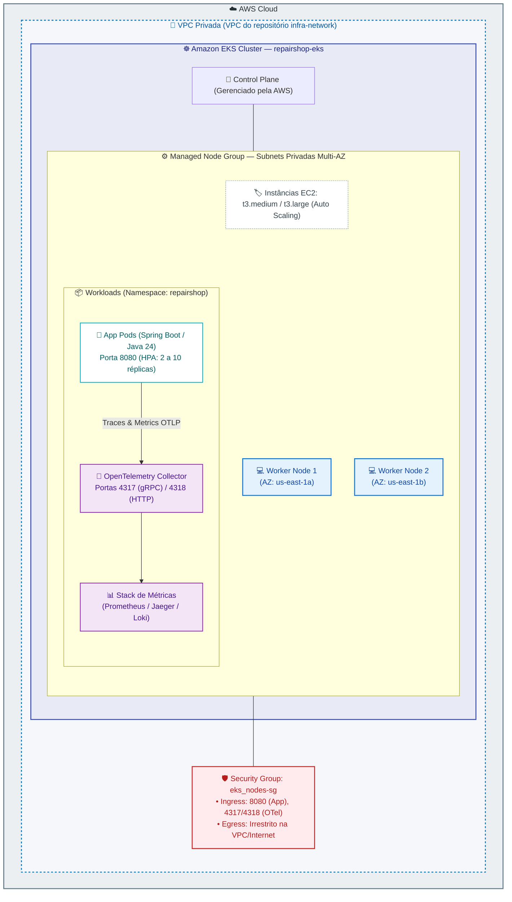
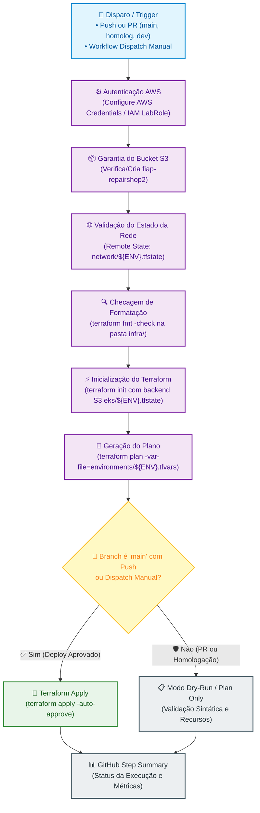
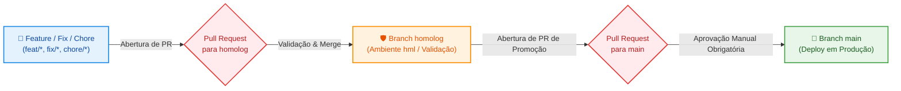

# ☸️ RepairShop — Infraestrutura Kubernetes (AWS EKS)

[](https://www.terraform.io/)
[](https://aws.amazon.com/eks/)
[](https://kubernetes.io/)
[](https://helm.sh/)
[](https://github.com/features/actions)

Repositório de **Infraestrutura como Código (IaC)** responsável pelo provisionamento do **Cluster Kubernetes Gerenciado (AWS EKS)**, **Managed Node Groups**, controladores essenciais e **Security Groups de Workloads** do projeto **RepairShop** (FIAP Tech Challenge — Fase 3).

---

## 🎯 Propósito e Escopo Arquitetural

Este módulo provisiona a camada de computação elástica em nuvem para execução dos microsserviços da aplicação e da stack de observabilidade OpenTelemetry:

- **EKS Control Plane Gerenciado:** Alta disponibilidade gerenciada pela AWS através de múltiplas Zonas de Disponibilidade (Multi-AZ).
- **Managed Node Groups em Sub-redes Privadas:** Worker Nodes EC2 provisionados estritamente nas sub-redes privadas da VPC para impedir qualquer exposição indevida à internet pública.
- **Security Groups Descentralizados (`aws_security_group.eks_nodes`):**
  - Porta `8080`: Tráfego HTTP da aplicação principal roteado via Load Balancer / API Gateway.
  - Portas `4317` (gRPC) e `4318` (HTTP): Ingestão de métricas e traces pelo OpenTelemetry Collector Gateway.
- **Integração com IAM LabRole (AWS Academy):** Configuração segura de roles de execução de nós e pods.
- **Evolução Multi-Ambiente:** Parametrização via `environments/dev.tfvars`, `hml.tfvars` e `prd.tfvars`.

---

## 🏗️ Topologia da Arquitetura do Cluster EKS



---

## 🗂️ Estrutura de Arquivos

```text
.
├── .github/workflows/
│   ├── ci-cd-eks.yml         # Pipeline principal de CI/CD (Build, Test & Deploy EKS)
│   └── destroy.yml           # Pipeline de destruição controlada com Safety Gate
├── infra/
│   ├── main.tf               # Cluster EKS, Node Groups, Security Groups e Remote State
│   ├── variables.tf          # Definição de instâncias, capacidade de nós e variáveis
│   ├── outputs.tf            # Export de Cluster Name, Endpoint, CA e SG ID
│   ├── providers.tf          # Configuração dos provedores AWS, Kubernetes e Helm
│   ├── versions.tf           # Versões mínimas requeridas de Terraform e Provedores
│   ├── backend.tf            # Configuração do backend remoto S3
│   └── environments/
│       ├── dev.tfvars        # Parâmetros de Desenvolvimento (1-2 nós t3.medium)
│       ├── hml.tfvars        # Parâmetros de Homologação (2 nós t3.medium)
│       └── prd.tfvars        # Parâmetros de Produção (2-4 nós t3.large)
└── README.md
```

---

## 🚀 Pipeline de CI/CD (GitHub Actions)

A esteira de integração e entrega contínua do EKS está configurada em [`.github/workflows/ci-cd-eks.yml`](.github/workflows/ci-cd-eks.yml).

### Desenho da Pipeline CI/CD



### Detalhamento e Justificativa de Cada Passo da Pipeline

| Passo | Ação Executada | Justificativa Arquitetural |
| :--- | :--- | :--- |
| **1. Checkout repository** | Obtém o código na versão exata do commit. | Garante a reproduzibilidade do provisionamento da infraestrutura. |
| **2. Configure AWS Credentials** | Autentica via credenciais seguras do GitHub Secrets. | Permite acesso aos recursos do laboratório AWS com permissões do `LabRole`. |
| **3. Ensure S3 Bucket State** | Valida a presença do bucket S3 `fiap-repairshop2`. | Previne falhas de inicialização do backend remoto de estado. |
| **4. Check Remote Network State** | Verifica se o arquivo `network/${ENV}.tfstate` existe no S3. | Garante a dependência arquitetural: o EKS só pode ser provisionado se a VPC e sub-redes já existirem. |
| **5. Setup Terraform** | Instala a versão `1.8.5` do Terraform. | Garante paridade de ambiente de execução com a infraestrutura de rede. |
| **6. Terraform Format Check** | Executa validação de lint e formatação HCL. | Mantém o padrão de estilo e legibilidade do código de infraestrutura. |
| **7. Terraform Init** | Inicializa os providers e conecta o estado `eks/${ENV}.tfstate`. | Mantém o estado do EKS totalmente desacoplado do estado da rede e do banco de dados. |
| **8. Terraform Plan** | Simula a criação/alteração dos recursos do EKS. | Permite auditoria prévia das mudanças sem aplicar efeitos colaterais. |
| **9. Terraform Apply** | Executa a criação do Cluster EKS e Node Groups na AWS. | Deploy automatizado exclusivo para a branch `main` ou disparo manual aprovado. |
| **10. Generate Summary** | Publica o resumo da execução no log da pipeline. | Rastreabilidade operacional imediata com detalhes do ambiente e status. |

### 💡 Decisão de Arquitetura: Estratégia de Único Job (Single Job)

> **Decisão Arquitetural:** O workflow foi desenhado com um **único JOB contínuo (`runs-on: ubuntu-latest`)**.
> 
> **Motivação Técnica:**
> 1. **Otimização de Limite de Minutos do GitHub Actions:** O provisionamento de um cluster Kubernetes gerenciado na AWS leva entre 8 a 15 minutos. Separar em múltiplos jobs exigiria múltiplos warm-ups de runners, esgotando rapidamente a cota mensal de minutos da conta.
> 2. **Sem Overhead de Caching/Re-download de Providers:** Os binários dos provedores AWS, Kubernetes e Helm permanecem em cache local durante todo o ciclo de vida do job.
> 3. **Consistência de Variáveis de Sessão:** As credenciais temporárias do AWS CLI e tokens de autenticação do cluster EKS são mantidos no mesmo contexto sem necessidade de reautenticação entre steps.

---

## 🔀 Governança de Branches e Ciclo de Promoção (Git Flow)

A governança do repositório segue isolamento estrito com aprovação controlada para promoção de ambientes:



> ⚠️ **Regra de Governança:** É expressamente proibido commit ou push direto na branch `main`. Toda alteração deve passar pelo pipeline de validação e aprovação formal.

---

## 💻 Execução e Deploy Local (Terraform CLI)

Para provisionar ou inspecionar o cluster localmente:

```bash
# 1. Navegue até a pasta de infraestrutura
cd infra

# 2. Inicialize o backend remoto S3
terraform init \
  -backend-config="bucket=fiap-repairshop2" \
  -backend-config="key=eks/dev.tfstate" \
  -backend-config="region=us-east-1"

# 3. Formate e valide o código
terraform fmt -check
terraform validate

# 4. Planeje a execução
terraform plan -var-file="environments/dev.tfvars"

# 5. Aplique as modificações
terraform apply -var-file="environments/dev.tfvars"

# 6. Atualize o kubeconfig local para acessar o cluster via kubectl
aws eks update-kubeconfig --region us-east-1 --name repairshop-eks-dev
kubectl get nodes
```

---

## 🔗 Links e Integrações no Ecossistema

- **Documentação Swagger UI da Aplicação:** [http://localhost:8080/swagger-ui/index.html](http://localhost:8080/swagger-ui/index.html)
- **Coleção Postman:** [`tech-challenge-repairshop-app/docs/postman/`](file:///c:/Users/Alexandre-AGAMIN/Projetos-%20FIAP/github-organizations-projects/tech-challenge-repairshop-app/docs/postman/)
- **Repositórios Relacionados:**
  - [`tech-challenge-repairshop-infra-network`](https://github.com/fiap-postech-repairshop/tech-challenge-repairshop-infra-network) (Fornece VPC e Subnets Privadas)
  - [`tech-challenge-repairshop-infra-db-rds`](https://github.com/fiap-postech-repairshop/tech-challenge-repairshop-infra-db-rds) (Banco de Dados PostgreSQL)
  - [`tech-challenge-repairshop-infra-apigateway`](https://github.com/fiap-postech-repairshop/tech-challenge-repairshop-infra-apigateway) (Roteador de Entrada / Proxy)
  - [`tech-challenge-repairshop-lambda-auth`](https://github.com/fiap-postech-repairshop/tech-challenge-repairshop-lambda-auth) (Autenticação Serverless)
  - [`tech-challenge-repairshop-app`](https://github.com/fiap-postech-repairshop/tech-challenge-repairshop-app) (Manifestos K8s e Código-Fonte da Aplicação)
